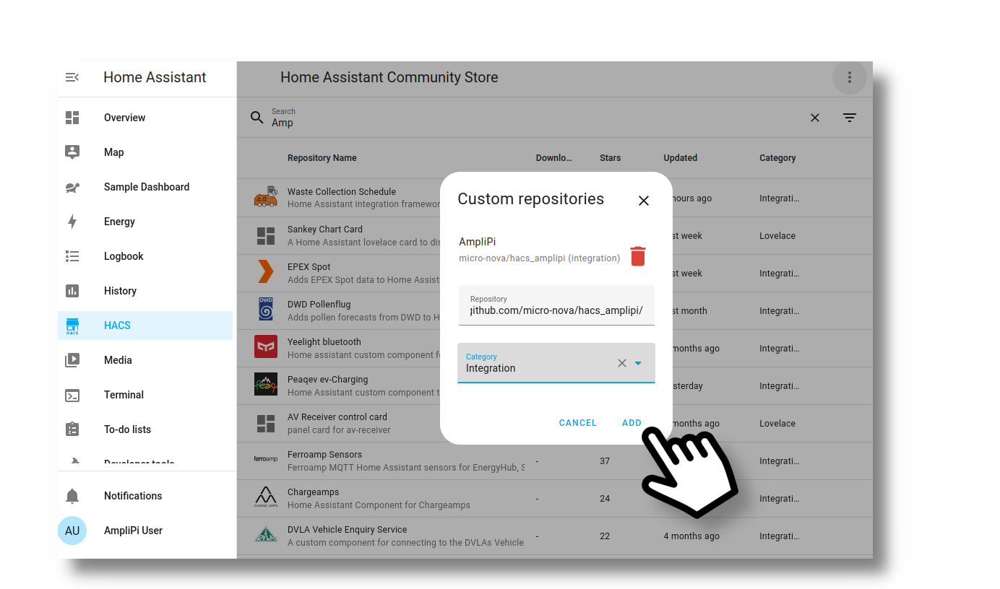

# AmpliPi Plugin for Home Assistant

This component adds support for auto-discovery and configuration of
AmpliPi Groups and Zones.

If you like this component, please give it a star on [github](https://github.com/brianhealey/hacs_amplipi).

## Installation

1. Ensure that [HACS](https://hacs.xyz) is installed.
1. Navigate to HACS on the sidebar and open the HACS settings by selecting the three dots icon. From there select "custom repositories".

1. A dialog box should appear. In it, paste a link to to this repo, found at `https://github.com/micro-nova/hacs_amplipi`, under "Repository." Under "Category," select "Integration." Then click "Add."

1. This will add the AmpliPi repository to your version of the HACS store! Search for it in the search bar and then click on it when it pops up.

1. On the store page, click "Download" to install the integration.

1. After the integration finishes installing, you will need to restart your Home Assistant. To do this, navigate to your Home Assistant's settings on the sidebar, then click the "Restart required." Your HomeAssistant will then reboot.

1. **AmpliPi** integration should auto-discover your AmpliPi, and prompt you to configure the integration.

In case you would like to install manually:

1. Copy the folder `custom_components/amplipi` to `custom_components` in your Home Assistant `config` folder.
2. **AmpliPi** integration should auto-discover your AmpliPi, and prompt you to configure the integration

AmpliPi devices do not report a distinct identifier, so this integration currently only supports one controller per installation.

Each Zone and Group will be auto-discovered and a separate `media_player` entity will be created per zone.

The AmpliPi Media Player entities support:
- Play
- Pause
- Off
- On
- PA

## Optional Setup
This component has an optional companion component that can be found at https://github.com/micro-nova/AmpliPi-HomeAssistant-Card if you wish to use home assistant as a ui for your AmpliPi software. You can install that by first installing the [MiniMediaPlayer](https://github.com/kalkih/mini-media-player) component which can be found by searching for it in the HACS searchbar, and then following the same installation guide as this component but replacing the repository link with https://github.com/micro-nova/AmpliPi-HomeAssistant-Card and with type "Dashboard"

## Example Automations
<!-- Blueprint download links made with https://my.home-assistant.io/create-link/?redirect=blueprint_import -->
### Start Streaming
This integration is for a whole-home audio system, in most cases you're likely to just want to play some music to some number of zones or groups at a specified volume. Luckily, we have a blueprint that does just that which you can install [here](https://my.home-assistant.io/redirect/blueprint_import/?blueprint_url=https%3A%2F%2Fgithub.com%2Fmicro-nova%2Fhacs_amplipi%2Fblob%2Fmain%2Fcustom_components%2Famplipi%2Fblueprints%2Fstart_streaming.yaml)
That particular blueprint doesn't provide any triggers, but the opportunites are endless, here's just a few examples: 
- Play music to a room when a motion detector notices someone is there (or disconnects when there isn't)
- Connect your TV's audio output to go to the surround sound speakers when you're watching something
- Set up a jukebox using RFID cards that are associated with a specific stream

## Credits

Cursor graphics used in this document from [Freepik](https://www.freepik.com/).